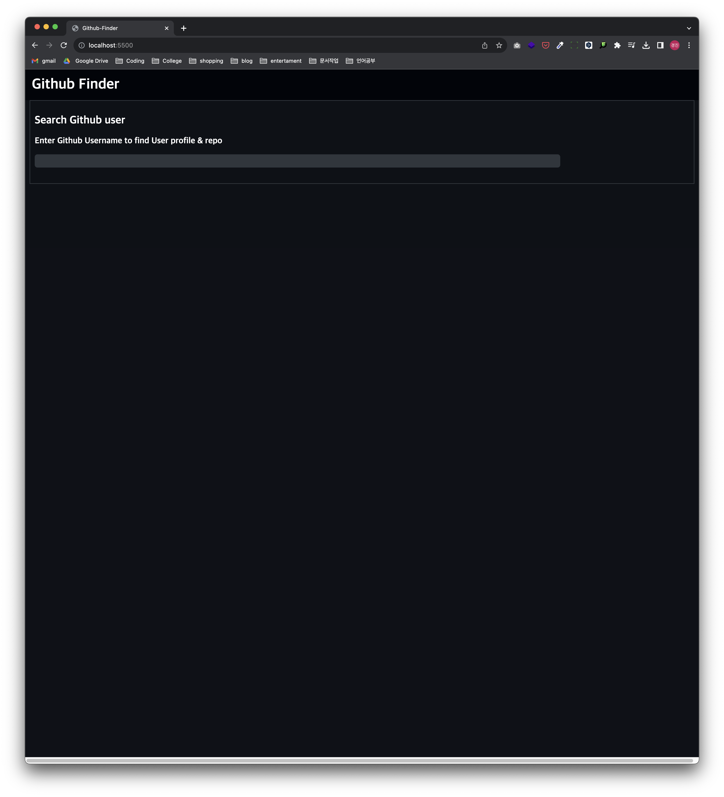
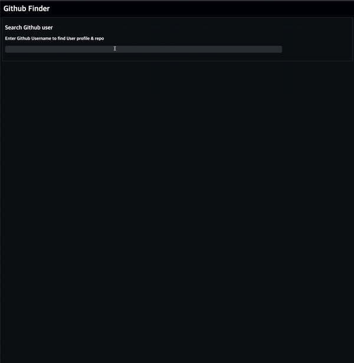
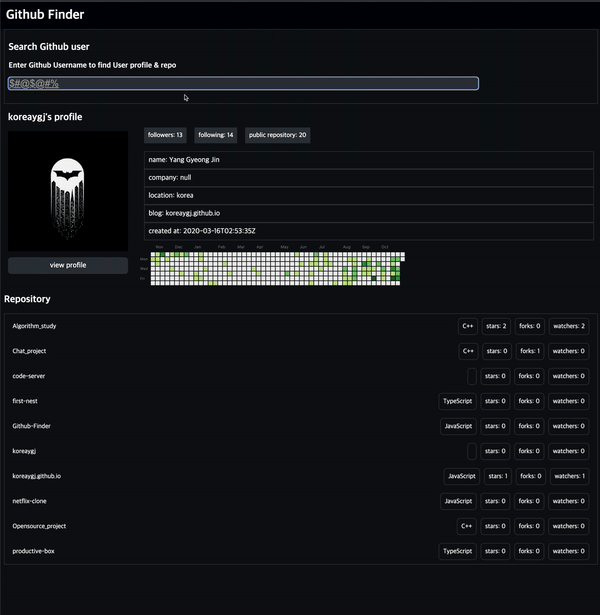
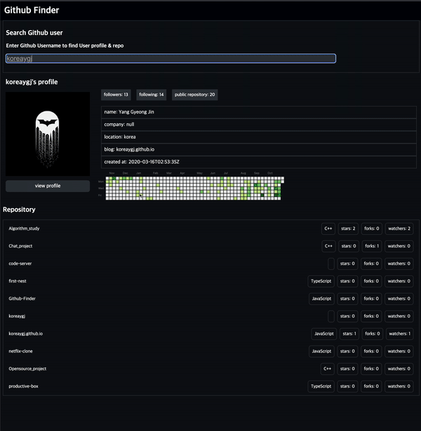
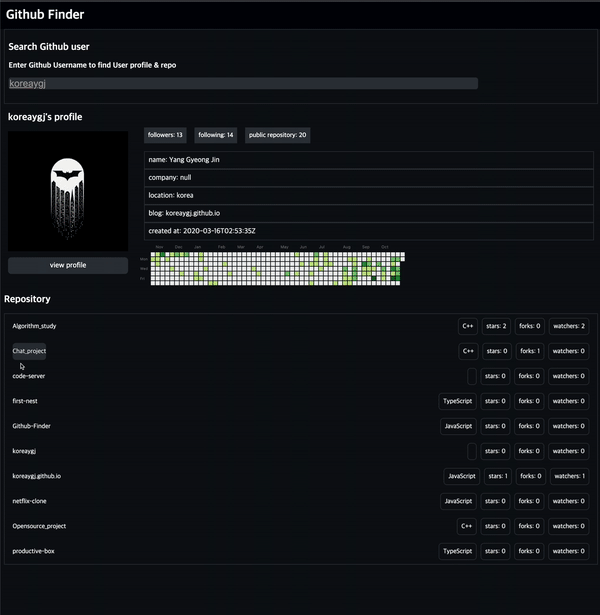

# Github Finder

## ⚙ Stacks

### Development

 

## 기능

- 메인 화면



- 프로필 & repository 탐색

  

  github 사용자의 username을 통해 탐색하고 프로필을 출력합니다.

- 검색전에 로딩화면 & Not found

  

  검색시에 모든 정보를 가져오기 전에 loading 화면을 출력합니다.  
  찾을 수 없는 사용자의 경우 Not Found를 출력합니다.

- 프로필과 Repo에 링크연결

  
  

  프로필 버튼과 Repository 이름을 클릭시에 github로 연결됩니다.

## 사용

github api를 사용하기 위해서는 개인 토큰이 필요합니다.  
 js 폴더에 githubToken.js 파일을 생성후 아래와 같이 저장해야합니다.

```js
export const config = {
githubToken: `${github 토큰}`,
};
```
